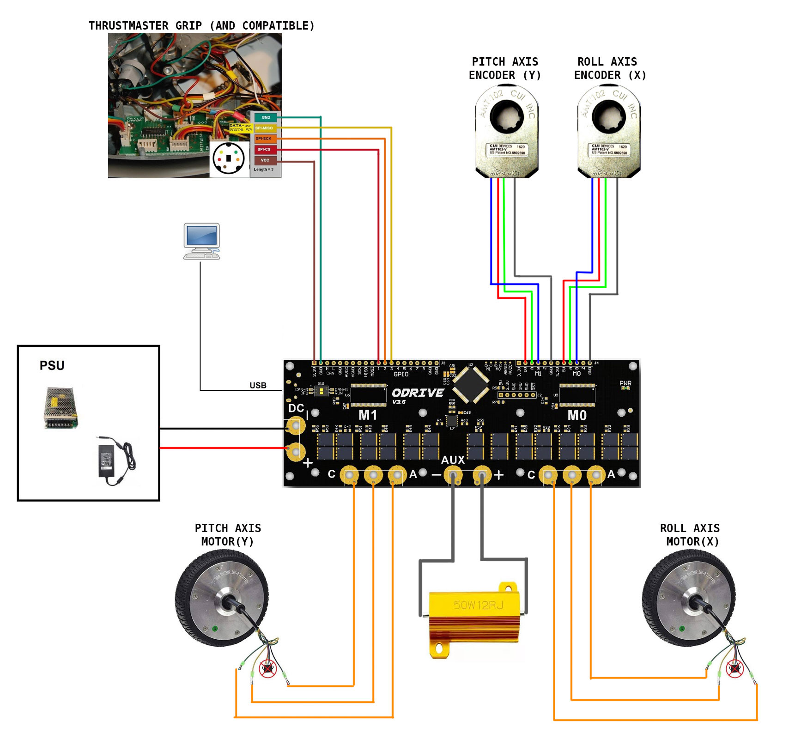
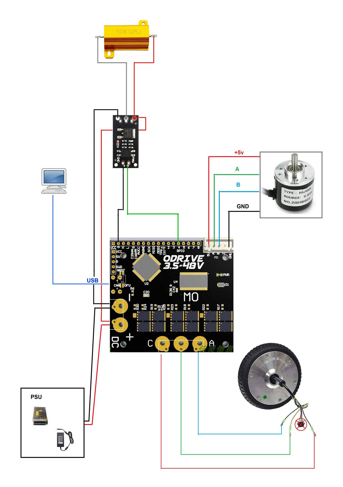

This project is all about high performance FFB joystick and FFB pedals for cheap(as it's possible).
The aim is to make it possible to use inexpensive brushless motors and ODrive board 
to fill the gap in mass production FFB devices for flight simulators.

Forum links:
* [DCS](https://forum.dcs.world/topic/246873-honey-i-developed-ffb-joystick-diy/)  
* [il2(ru)](https://forum.il2sturmovik.ru/topic/12943-%D0%BD%D0%B0%D1%80%D0%BE%D0%B4%D0%BD%D1%8B%D0%B9-ffb-%D0%B2%D0%BE%D0%B7%D0%BC%D0%BE%D0%B6%D0%BD%D0%BE/)
### Requirements

* ODDrive Board (Tested on two axis ODrive, one axis ODrive and ODESC3.6 clones)
* Brushless  motor of your choice. Should work with any. Consider hoverboard motor and 63xx motor series as a good option to start
* Incremental Encoder. Suppports both OMRON style encoders and AMT 102/103 series. 

* STLINK (Optional. For ODrive versions that do not have DFU switch onboard, f.e. ODESC3.6)

### Joystick mechanics

There is no restriction for gimbal design and materials, so you can choose any scheme you think suits your needs. 
If you do not want to invent the wheel on your own, you can pick one of schemes that are already tested:
* [High force base with howerboard motors and metal gimbal](https://github.com/o-devices/ffb-joystick-howerboard-motor-base)
* Medium force base with 63xx motors and metal gimbal(coming soon)

### Pedals mechanics (coming soon)

### Wiring diagrams
#### Joystick

#### Pedals

