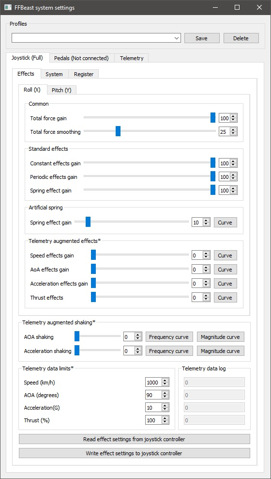

Первым действием после подключения джойстика необходимо нужно настроить направление осей. 
В целях безопасности ставим силу по осям на 0.
Ставим **Total force gain** по оси **X** и **Y** в 0 и нажимаем **Write effect settings to joystick controller**.

Запускаем джойстик вьюер любой который нравиться и проводим тэст.

Двигаем ручкой по крену влево-вправо. Точка должна двигаться в ту же сторону в которую двигается рука.
Если направление противоположное заходим в вкладку **System** и меняем состояние галочки **Invert** по оси **X**.  

Повторяем то же самое для оси Y. При движении от себя на себя точка должна двигаться в том же направлении что и рука.
Если противоположное - на вкладке **System** меняем  меняем состояние галочки **Invert** по оси **Y**.

**ВНИМАНИЕ!** При проведении следующего шага ручку может бросить в одно из крайних положений.
Лушче быть готовым! Еще лучше снять ручку и удлинитель. В любом случае быть готовым. 

Жмем кнопку **Write system settings to joystick controller**. Происходит запись направления осей в контролер. 
После этого джойстик надо перезапустить (с отключением питания. **Простое отключение от USB не перезапускает ODrive**)

После настройки осей направление работы ручки будет совпадать с направлением осей джойстика в системе. 
Теоретически игры должны воспринимать оси аналогично. 
По умолчанию в DCS направление осей и тримеров расчитано на такое направление осей.

Теперь можно вернуть усилие по осям к нужным значениям и продолжить настройку усилия эффектов (coming soon)

