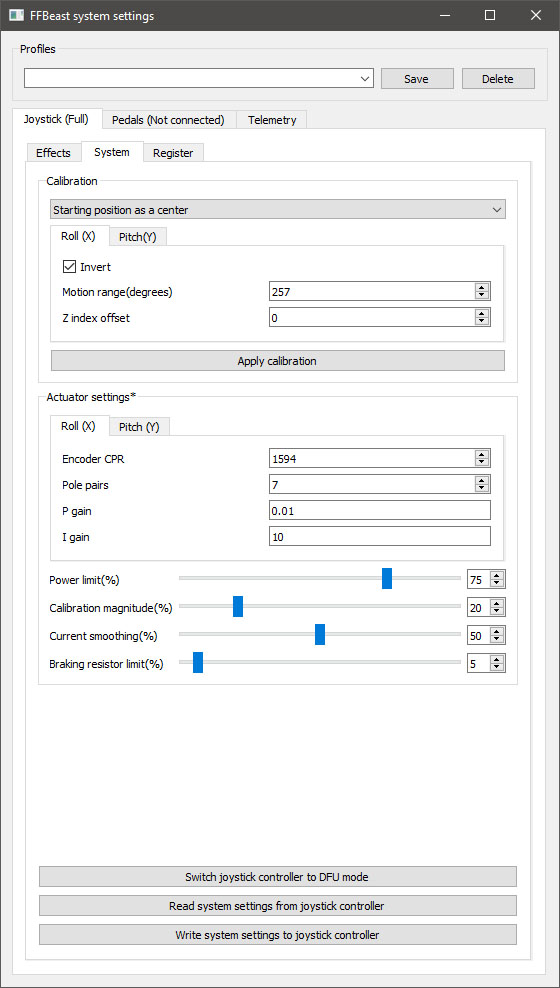

## Содержание
### [Настройка направления осей](#настройка-направления-осей)

### [Настройка крайних положений](#настройка-крайних-положений)

### [Настройка эффектов](#настройка-эффектов)

## Настройка направления осей

**ВНИМАНИЕ! Первичную настройку лучше производить с отключенными моторами. 
Если возможности отключить моторы нет, то выставить Power limit и Torque Gain в минимальные значения. 
При проведении следующего шага ручку может бросить в одно из крайних положений.
Лушче быть готовым! Еще лучше снять ручку и удлинитель. В любом случае соблюдать осторожность**.

Ставим **Total force gain** по оси **X** и **Y** в 0, **Power limit** в 0 и нажимаем **Write effect settings to joystick controller**.

Запускаем джойстик вьюер любой который нравиться и проводим тэст.

Двигаем ручкой по крену влево-вправо. Точка должна двигаться в ту же сторону в которую двигается рука.
Если направление противоположное заходим в вкладку **System** и меняем состояние галочки **Invert** по оси **X**.  

Повторяем то же самое для оси Y. При движении от себя на себя точка должна двигаться в том же направлении что и рука.
Если противоположное - на вкладке **System** меняем  меняем состояние галочки **Invert** по оси **Y**.

Жмем кнопку **Write system settings to joystick controller**. Происходит запись направления осей в контролер. 
После этого джойстик надо перезапустить (с отключением питания. **Простое отключение от USB не перезапускает ODrive**)

После настройки осей направление работы ручки будет совпадать с направлением осей джойстика в системе. 
Теоретически игры должны воспринимать оси аналогично. 
По умолчанию в DCS направление осей и тримеров расчитано на такое направление осей.

## Настройка крайних положений
На сегодняшний день реализована только примитвная калибровка при запуске. 
Более продвинутые калибровки будут добавлены в следующих версиях, но сейчас границы перемещения нужно задавать принудительно.
Это делается все на той же вкладке **System** путем изменения параметра **Motion range (degrees)**.
Для этой процедуры удобнее всего воспользоваться программой [VKB_JoyTester](https://vkbcontrollers.com/wp-content/uploads/2019/02/VKB_JoyTester.zip).
Вообще очень удобная програмка для просмотра динамических графиков джойстика. Рекомендую ее для наглядного просмотра данных по осям.

Начинаем с включения джойстика. В текущей прошивке позиция в которой на котролер подается питание считается 0 по обеим осям. 
Дожидаемся пока ручка сделает небольшое движение влево-вправо вперед-назад. Это процедура определения нулевого положения фаз мотора.
После этой процедуры джойстик начинает слать координаты по осям **X** и **Y**.   

Перемещаем до упора влево-вправо и вперед-назад. Смотрим по графикам что оси доходят до краев.
Если по какой-то оси до краев не доходит - добавляем значение **Motion range (degrees)** по соответствующей оси. 
Если доходит до края раньше чем ручка до физического упора - убавляем. После изменениея значения жмем **Write system settings to joystick controller**.
Значения применяются моментально после нажатия кнопки.

## Настройка эффектов
Для удобства настройки силы эффектов в прошивку добавлен вывод рассчитаных услий по осям Slider1 и Slider2.
Поэтому с помошью все того же VKB_Joytester можно наблюдать графики этого усилия в соответствии с отклонением ручки.

Например здесь показано как выглядит рассчитаная сила по осям с установленой  **Artificial spring** в значение 10 по обеим осям.

Страница эффектов настраивает как силу стандартных эффектов так и силу эффектов рассчитаных из телеметрии.  

### Common

Общие настройки влияющие на суммарное усилие с учетом стандартных и искусственных эффектов. Здесь всего два параметра:

<ul>
<li>
Total force gain - процент общего усилия от потенциального максимума. Ставим стоьлко сколько потянет бицепс :)
</li>
<li>
Total force smoothing - сглаживание. В общем случае ставим в минимально возможное. 
База на ховерборд моторах прекрасно работает если значение стоит 0. 
Но потенциально может понадобиться при других конструкциях базы
</li>
</ul>

### Standard effects

Сила индивидуальных эффектов.
При использовании без добавки искуственных эффектов ставим все в 100.
В таком виде эффекты будут воспроизводиться тем усилием как их щлет игра без каких либо изменений.

<ul>
<li>
Constant effects gain - Эффекты постоянной силы.
Обычно эффекты которые тянут ручку в какуюто сторону не зависимо от позиции.
DCS данный эффект не использует.
</li>
<li>
Periodic effects gain - Всякого рода тряска и вибрация идут по этому эффекту. 
</li>
<li>
Spring effect gain - Главная пружина. Тримирование также идет по этому эффекту. 
</li>
</ul>

### Artificial spring

Это искуственная пружина не зависимая ни от каких других эффектов. 
Поддерживает настройку кривой отклика по силе. 
Основное назначение - игры без обратной связи для которых еще не реализована телеметрия.
В общих случаях можно установить на 5-ку.
При таких значениях ее эффект практически не заметен в общих эффектах, 
но по опыту добавляет немного плавности на околонулевых положениях джойстика. 

## Телеметрия (coming soon)